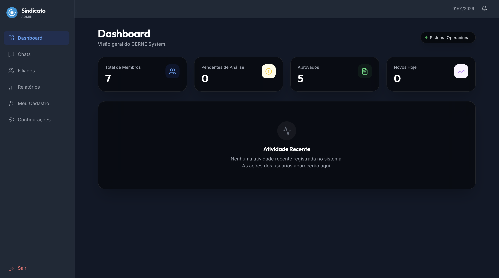
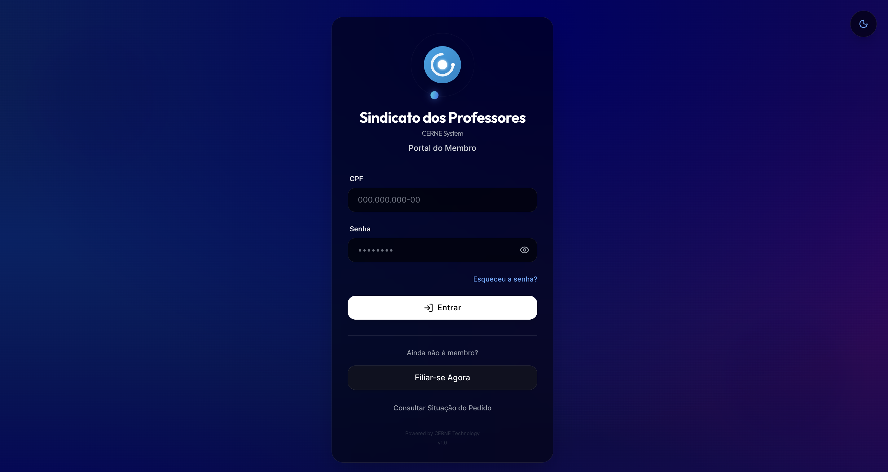
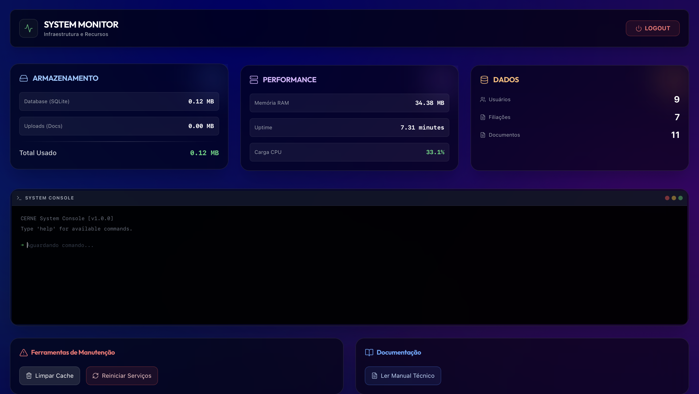

# 🌐 CERNE - Gestão Sindical do Futuro

<div align="center">
  
  <br />
  
  
  
  
  
  

  ### **A Plataforma Definitiva para Gestão de Filiados, Documentos e Comunicação.**
  *Segurança Corporativa • Design Premium • Auditoria Total*
  
  [🇺🇸 English](README.md) | [🇧🇷 Português](README.pt-br.md)
  
  ---
  
  <p align="center">
    <a href="#-visão-geral">Visão Geral</a> •
    <a href="#-funcionalidades">Funcionalidades</a> •
    <a href="#-arquitetura-técnica">Arquitetura</a> •
    <a href="#-instalação">Instalação</a> •
    <a href="#-contribuindo">Contribuição</a> •
    <a href="#-autor">Autor</a>
  </p>
</div>

---

## ✨ Visão Geral

O **CERNE System** nasceu de uma necessidade real: transformar a burocracia sindical em uma experiência digital fluida, segura e transparente. Abandonamos as planilhas manuais e os processos em papel para criar um **ecossistema SaaS** completo.

Focado em **Experiência do Usuário (UX)** de alto nível, o sistema utiliza uma estética _"Liquid Glass"_ moderna, combinada com uma engenharia de segurança robusta que garante a integridade de dados sensíveis de milhares de filiados.

### 🖼️ Preview
> <div align="center">
>   
>   <br /><br />
>   <div style="display: flex; gap: 10px;">
>     
>     
>   </div>
> </div>

---

## 🚀 Funcionalidades

### 🏛️ Módulo Core (Gestão de Filiados)
*   **Onboarding Digital:** Cadastro passo-a-passo com validação em tempo real (CPF, CEP).
*   **Ciclo de Vida:** Controle de status (Pendente, Ativo, Suspenso, Desativado).
*   **Carteirinha Digital:** Geração automática de credenciais com QR Code.
*   **Document Management:** Upload seguro de PDFs e imagens com versionamento.

### 🔐 Segurança & Auditoria (Enterprise Grade)
*   **Logbook Imutável:** Rastreabilidade total de ações (Quem fez? O que fez? Quando? De onde?).
*   **Blindagem de Chat:** Filtro ativo de conteúdo (RegEx) que bloqueia mensagens ofensivas em tempo real.
*   **Criptografia:** Senhas hashadas com **Bcrypt** e comunicação via Tokens JWT (Stateless).
*   **WAF Básico:** Rate limiting e sanitização de inputs contra SQL Injection e XSS.

### 💬 Comunicação & Suporte
*   **Chat em Tempo Real:** WebSockets para comunicação instantânea entre Admins e Suporte.
*   **Notificações Globais:** Sistema de avisos broadcast para todos os usuários.
*   **Helpdesk Integrado:** Abertura e acompanhamento de chamados.

### 📊 Painéis de Controle
*   **Admin Dashboard:** Métricas, KPIs de filiação e atalhos rápidos.
*   **Tech Admin Panel:** Monitoramento de saúde do servidor (CPU, Memória, Banco de Dados).

---

## 🛠️ Arquitetura Técnica

O projeto segue uma **Arquitetura Modular Monolítica**, ideal para escalar sem a complexidade desnecessária de microserviços iniciais.

### Stack Tecnológico

| Camada | Tecnologias |
| :--- | :--- |
| **Frontend** | React.js, TailwindCSS (Glassmorphism), Framer Motion, Axios, Lucide React |
| **Backend** | Node.js, Express, Socket.io (Realtime), PDFKit (Gerador de Docs) |
| **Database** | SQLite (Dev/Staging) / PostgreSQL (Ready for Prod) |
| **Security** | Helmet, CORS, Rate-Limit, Bcrypt, JWT |
| **DevOps** | Vite, Nodemon, ESLint Security |

### 📂 Estrutura de Diretórios
```bash
/
├── backend/            # API RESTful & WebSocket Server
│   ├── src/
│   │   ├── controllers/   # Regras de Negócio
│   │   ├── middlewares/   # Segurança e Validações
│   │   ├── routes/        # Rotas da API
│   │   └── services/      # Integrações (Email, PDF)
│   ├── db/                # Schema e Migrations
│   └── uploads/           # Armazenamento Local (Dev)
│
├── frontend/           # SPA React Moderno
│   ├── src/
│   │   ├── components/    # UI Kit Reutilizável
│   │   ├── contexts/      # Gestão de Estado Global
│   │   ├── pages/         # Telas da Aplicação
│   │   └── hooks/         # Lógica Customizada
│
└── landing-page/       # Site de Apresentação (Showcase)
```

---

## ⚡ Instalação e Execução

### Pré-requisitos
*   **Node.js** (v18 ou superior)
*   **NPM** ou **Yarn**

### Passo a Passo

1.  **Clone o repositório**
    ```bash
    git clone https://github.com/SainthixOli/filiacao_sindicato.git
    cd filiacao_sindicato
    ```

2.  **Configure e Rode o Backend**
    ```bash
    cd backend
    npm install
    cp .env.example .env # Configure suas variáveis
    npm run dev
    # O servidor iniciará em http://localhost:3000
    ```

3.  **Configure e Rode o Frontend**
    ```bash
    cd ../frontend
    npm install
    npm run dev
    # A aplicação abrirá em http://localhost:5173
    ```

4.  **Landing Page (Opcional)**
    ```bash
    cd ../landing-page
    npm install
    npm run dev
    ```

---

## 🤝 Contribuindo

Contribuições são bem-vindas! Este é um projeto **Open Source** focado em aprendizado e inovação.

1.  Faça um **Fork** do projeto.
2.  Crie uma Branch para sua Feature (`git checkout -b feature/IncrivelFeature`).
3.  Faça o Commit (`git commit -m 'Add some IncrivelFeature'`).
4.  Push para a Branch (`git push origin feature/IncrivelFeature`).
5.  Abra um **Pull Request**.

---

## 👤 Autor

<div align="center">
  
  <br />
  <sub><b>Oliver Arthur</b></sub>
  <br />
  <i>Estudante de Engenharia de Software @ Uniceplac</i>
  <br />
  <br />

  [](https://www.linkedin.com/in/oliver-arthur-souza-pinheiro-677b24376/) 
  [](mailto:oliverarthursouzapinheiro@gmail.com)
</div>

---

<p align="center">
  Feito com 💙 e muito café por Oliver Arthur.
</p>
